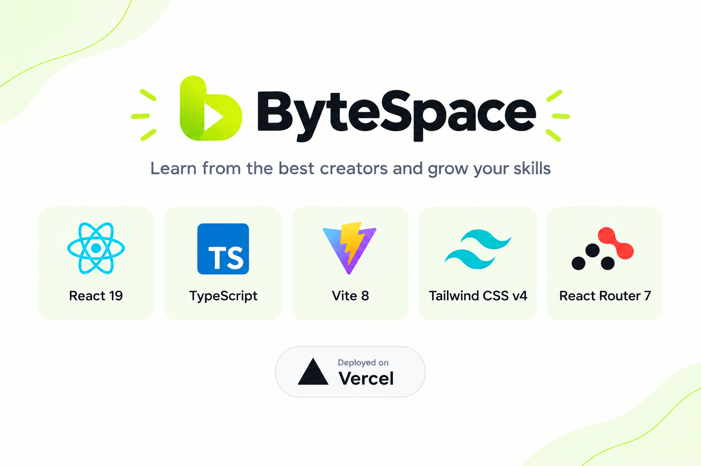
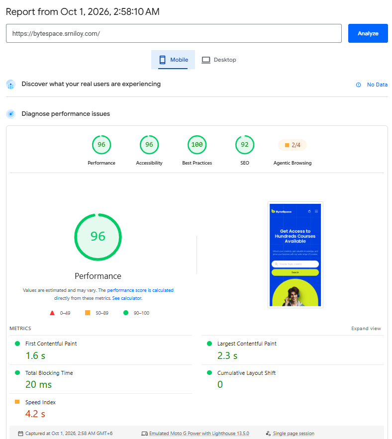
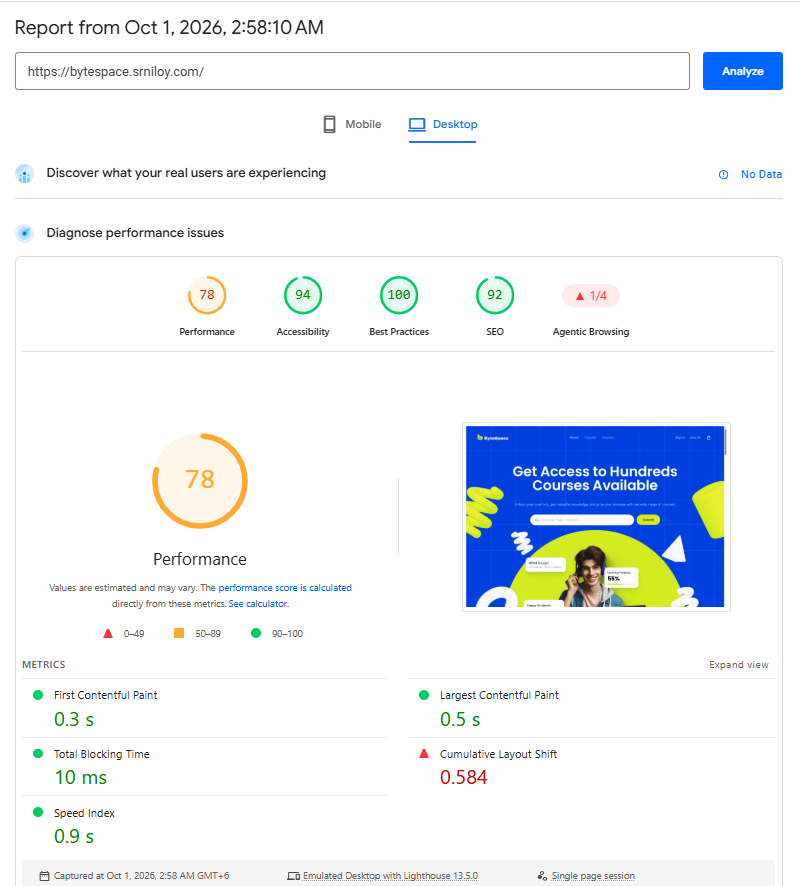
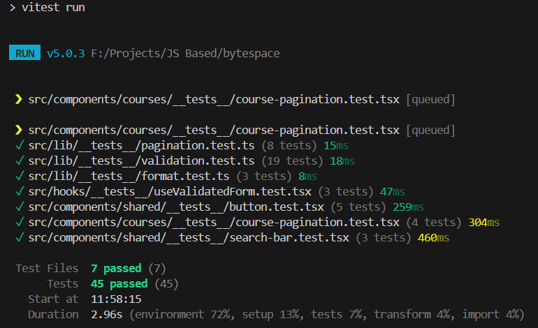
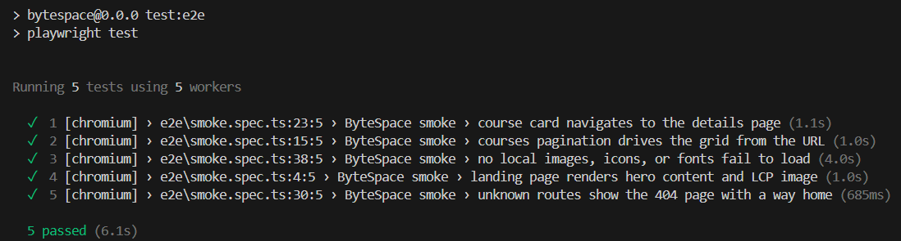
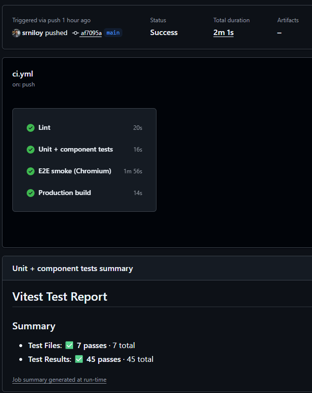

# ByteSpace - Course Marketplace

Responsive course-marketplace landing (Figma: **ByteSpace**) with Courses, Creators,
Course Details, Login/Sign-up (bonus scope, visual), and a 404 page.

- **Live:** https://bytespace.srniloy.com
- **Design source:** ByteSpace (Figma)

## Stack & decisions



**Why Vite and not Next.js:** this assessment is a static, content-driven landing with no
server data requirements, so Vite gives the fastest build/preview loop. The code is
structured to port 1:1 to the Next.js App Router: `data/` (content) vs `types/`
(contracts) mirrors `app/` + colocated types, `lib/` holds framework-free logic, and all
routing state lives in the URL (`/courses?page=2`), which maps directly to searchParams.

## Getting started

```bash
npm ci
npm run dev        # local dev
npm run build      # typecheck + production build
npm run preview    # serve dist/ locally
npm test           # 45 unit/component/hook tests (Vitest)
npm run test:e2e   # 5 Chromium smoke tests (Playwright)
```

First run on a new machine: `npx playwright install chromium`.

## Architecture

```
src/
  components/{shared,courses,creator,course-details,home,auth}  # UI by feature
  data/        # content values only (mock catalogue)
  types/       # domain contracts, 1:1 with data/ basenames
  lib/         # framework-free logic (cn, pagination, format, validation, preload)
  services/    # api-client stub (fetch + timeout/abort + ApiError)
  hooks/       # usePageTitle, scroll restoration, validated-form state
e2e/           # Playwright smoke spec (real browser, production build)
```

- **Design tokens live in one place:** `src/index.css` (`--color-persian-blue`,
  `--color-accent-lime`, `--color-chip`, type scale). No hard hex in components.
- **Reusable primitives:** `shared/button` (`cva` variants), `shared/container`,
  `shared/section-heading`, `shared/avatar-stack`.
- **URL is the source of truth** for pagination (`?page=`), so back/forward/share work.

## Coding standards

- **TypeScript strict, zero `any`** - `noUnusedLocals/Parameters`, `verbatimModuleSyntax`,
  `erasableSyntaxOnly`; every boundary (props, data, API) is interfaced in `types/`.
- **ESLint clean, zero suppressions** - `recommended` + `typescript-eslint` + `react-hooks`
  + `react-refresh` rule sets, gated in CI; no `eslint-disable` in `src`.
- **Conventional commits** (`feat:`, `fix:`, `docs:`, `test:`, `refactor:`, `chore:`) with
  branch-per-PR and a PR template (screenshots + test plan).
- **Naming & structure** - kebab-case files, PascalCase components, `use*` hooks;
  pure logic in `lib/` (framework-free, unit-tested), values in `data/`, contracts in `types/`.
- **Design tokens over magic values** - colors, type scale, and spacing in `index.css`
  (`bg-persian-blue`, `heading-m`…); `cn()` + `cva` for variant props.
- **Accessible by default** - associated labels, `aria-invalid`/`aria-describedby` on
  invalid fields, `aria-current` on pagination, skip link, `aria-busy` skeletons.
- **URL-driven state** - pagination lives in search params, so views are shareable and
  testable from the URL alone.

## Performance story

Measured with Lighthouse (Mobile, Moto G Power, Slow 4G) against the Vercel deployment.
Biggest wins, in order of impact:

| # | Change | Effect |
|---|--------|--------|
| 1 | Self-hosted Poppins + Satoshi in `public/fonts` (was: 1.2–1.6 s third-party font chain) | FCP/LCP unblocked, font CLS gone |
| 2 | All 52 raster images PNG/JPG → WebP (`public/images` ~2 MB → ~0.5 MB; layouts ~205 KB → ~62 KB; icons ~45 KB → ~25 KB) | LCP bytes slashed |
| 3 | Hero LCP fast-path: `fetchpriority`, explicit `676×515`, `<link rel="preload">` | LCP element discovered immediately |
| 4 | Removed `framer-motion` (~100 KB) → identical CSS hover transitions | Less JS on first load |
| 5 | `react-photo-view` (123 KB) deferred until after first paint; `MobileMenu` code-split | Off-critical-path JS |
| 6 | Reserved image space (`width`/`height` on logos, hero, growth, 404) | CLS 0.595 → ~0 (footer logo alone was 0.584) |
| 7 | `vite-plugin-image-optimizer` in build + immutable year-long cache (`vercel.json`) | Permanent guardrails |
| 8 | Route-aware skeletons paint each destination's own background/structure while chunks load (white spinner removed; blue base coat in `index.html`) | No white flash, no layout jump on navigation |
| 9 | Course grid skeletonizes on slow page changes (stale-while-revalidate with a 150 ms grace, so fast swaps stay instant) | Slow pages feel intentional, fast pages stay instant |

| Metric (mobile) | Before (Oct 1, prod run) | After |
|---|---|---|
| FCP | 3.3 s | 1.6 s |
| LCP | 3.4 s | 2.3 s |
| CLS | 0 | 0 |
| Speed Index | 4.7 s | 4.2 s |
| Performance score | 83 | 96 |

Desktop baseline from the same run: Performance 77, FCP 0.5 s, LCP 0.8 s,
CLS 0.568 (unsized footer logo), Speed Index 1.0 s.

Production Lighthouse, Oct 1 (Moto G Power + Slow 4G on mobile) - taken after the
WebP/bundle work was live; the font self-host and logo-dimension fixes above ship with
the next deploy, then re-run to fill the After column:

| Mobile (Performance 96) | Desktop (Performance 78) |
|---|---|
|  |  |

## Testing story

- **45 Vitest tests:** `lib/` pure logic (pagination clamping/edge cases, price format,
  validation rules) + `Button`, `CoursePagination`, `SearchBar` component specs +
  `useValidatedForm` hook contract specs.

  
- **5 Playwright smoke tests** (`e2e/smoke.spec.ts`, Chromium, against `dist/`):
  landing hero + LCP image, `?page=2` grid state, card → details navigation, 404 → home,
  zero failed local asset requests.

  
- **CI (`.github/workflows/ci.yml`):** lint, unit, e2e, build on every PR.

  
- **Found by the suite:** the card's stretched link sat under the media layer, so
  clicking a course image did nothing - fixed (`z-[1]`, creator byline stays `z-10`).

Deliberately out of scope: backend wiring for auth (forms validate fully client-side via
a schema-driven `useValidatedForm` hook - silent typing, blur checks, submit reveals all;
only the API call is a TODO), MSW (direct `fetch` stubs suffice at this size), coverage
thresholds.

## Known limitations

- Catalogue content is local mock data; there is no backend yet (`services/api-client.ts`
  is ready for it, and the auth forms already validate against schemas awaiting that API).
- Category/level filters are visual-only; pagination and search props are wired.
- The course gallery lightbox upgrades just after first paint by design (123 KB kept off
  the critical path).
